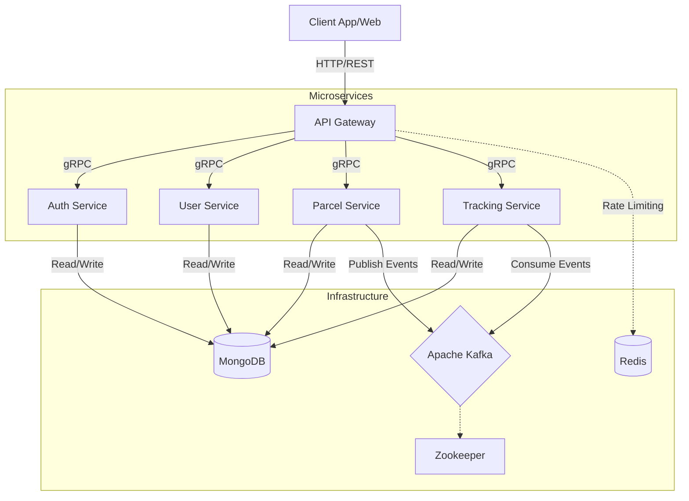

# PDTS-Go: Parcel Delivery Tracking System

PDTS-Go is a comprehensive microservices-based application derived from the PDTS project, re-engineered using Go. It allows users to manage parcel deliveries, track shipments in real-time, and handle user authentication and management efficiently.

## 🚀 Architecture

The project follows a **Microservices Architecture**, separating concerns into distinct, independently deployable services:



### Service Descriptions
- **API Gateway**: Entry point for all client requests, routing them via gRPC. Handles Auth and Rate Limiting (Redis).
- **Auth Service**: Manages user authentication (JWT) and authorization.
- **User Service**: Manages user profiles.
- **Parcel Service**: Core service for creating and updating parcels. Publishes events to Kafka.
- **Tracking Service**: Consumes parcel events to maintain tracking history.

### Data Flow
1.  **Synchronous**: Client -> Gateway -> gRPC -> Service -> MongoDB.
2.  **Asynchronous**: Service -> Kafka Event -> Tracking Service -> MongoDB (Tracking History).

## 🛠️ Technology Stack

- **Programming Language**: [Go (Golang)](https://go.dev/) (v1.23+)
- **Web Framework**: [Gin Gonic](https://gin-gonic.com/) - High-performance HTTP web framework.
- **Database**: [MongoDB](https://www.mongodb.com/) - NoSQL database for flexible data storage.
- **Caching**: [Redis](https://redis.io/) - Used for rate limiting and temporary data storage.
- [Apache Kafka](https://kafka.apache.org/) - For event streaming and asynchronous messaging.
- **Inter-service Communication**: [gRPC](https://grpc.io/) - High-performance, open-source universal RPC framework.
- **Service Discovery & Coordination**: [Zookeeper](https://zookeeper.apache.org/) (used by Kafka).
- **Containerization**: [Docker](https://www.docker.com/) & Docker Compose.
- **Build Tool**: Make

## 📋 Prerequisites

Before running the project, ensure you have the following installed:

- **Go**: Version 1.23 or higher.
- **DockerDesktop**: For running Kafka, Zookeeper, MongoDB, and Redis.
- **Make**: For executing build and run commands.

## 🚦 Getting Started

### 1. Clone the Repository

```bash
git clone https://github.com/sachinggsingh/PDTS-Go.git
cd PDTS-Go
```

### 2. Environment Configuration

The services use environment variables. In Docker, these are managed via the `docker-compose.yaml` and optional `.env` files in each service directory. 

> [!NOTE]
> Physical `.env` files are optional inside containers as Docker Compose injects the variables directly.

### 3. Running with Docker (Recommended)

The easiest way to run the entire system is using Docker Compose. This starts all microservices, MongoDB, and Kafka infrastructure.

```bash
docker-compose up --build
```

This will:
- Build the images for all Go services.
- Start MongoDB, Kafka, and Zookeeper.
- Launch all microservices and the API Gateway.

### 4. Running Locally (Development)

If you prefer to run services manually for development:

**Infrastructure Setup:**
```bash
docker-compose up -d mongodb kafka zookeeper redis
```

**Install Dependencies:**
```bash
make tidy-all
```

**Run Services:**
Use the provided `Makefile` to run individual services:
- `make run-gateway`
- `make run-auth`
- `make run-user`
- `make run-parcel`
- `make run-tracking`

## 🔌 API Endpoints

The **API Gateway** (Port `8080`) serves as the unified entry point:

- **Auth**: `http://localhost:8080/auth/...`
- **User**: `http://localhost:8080/users/...`
- **Parcel**: `http://localhost:8080/parcels/...`
- **Tracking**: `http://localhost:8080/tracking/...`

### Health Checks
Each service provides a health check endpoint:
- `http://localhost:8080/health` (Gateway)
- `http://localhost:8081/health` (Auth)
- `http://localhost:8082/health` (Parcel)
- `http://localhost:8083/health` (Tracking)
- `http://localhost:8084/health` (User)

## 📂 Project Structure

```
PDTS-Go/
├── api-gateway/       # API Gateway Service
├── auth-service/      # Authentication Service
├── parcel-service/    # Parcel Management Service
├── tracking-service/  # Tracking Service
├── user-service/      # User Management Service
├── proto/             # gRPC Service Definitions (.proto files)
├── pb/                # Generated gRPC Go code (shared module) for server and client stubs
├── k8s/               # Kubernetes Manifests
├── docker-compose.yaml # Full System Orchestration
├── Makefile           # Local execution shortcuts
└── README.md          # Project Documentation
```